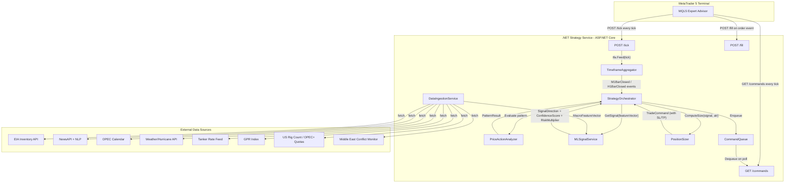

# MT5 Oil Trader — MVP Spec

## Goal

An automated trading bot for oil (XTIUSD / USOIL) on MetaTrader 5, driven by a .NET strategy service. The bot combines timeframe arbitrage (H1 signal → M1 execution), price action analysis, and a multi-role ML model. Every order has mandatory SL/TP.

---

## Architecture Overview




---

## Components

### 1. MQL5 Expert Advisor

- Runs inside MT5 on the XTIUSD chart (M1 timeframe)
- On every tick:
  - `POST /tick` — sends `{ symbol, bid, ask, time, volume }`
  - `GET /commands` — fetches pending trade orders (commands re-delivered until acknowledged)
- After successful `OrderSend()`: `POST /commands/{id}/ack` — acknowledges command, removes it from queue
- On order event (open/close/modify): `POST /fill` — sends execution report
- Executes orders received from .NET: `OrderSend()` with SL and TP always set
- Checks server time against a configurable trading window (default Mon 01:00 – Fri 23:00 UTC); skips `POST /tick` and `GET /commands` outside that window
- No strategy logic lives here — pure execution layer

### 2. ASP.NET Core Strategy Service

**Security:** The service binds to `127.0.0.1` only (`urls: http://127.0.0.1:5000`). No auth header is required; network isolation is the sole security boundary. Both MT5 and the .NET service run on the same machine.

**Controllers:**

- `TickController` — stores incoming ticks in an in-memory rolling buffer (last 1 000 ticks, `ConcurrentQueue`); calls `tfa.Feed(tick)` on each tick
- `CommandController` — serves queued `TradeCommand` objects (buy/sell/close/modify); commands remain in the queue until the EA sends `POST /commands/{id}/ack` after successful `OrderSend()`; unacknowledged commands are re-delivered on every poll
- `FillController` — persists fill records (open price, SL, TP, ticket, timestamp) to a database for future offline model retraining; specific database TBD at implementation time

**TimeframeAggregator:**

- Builds H1 OHLCV bars from incoming M1 tick data in memory
- Exposes two C# events: `M1BarClosed` and `H1BarClosed`
- `TickController` calls `tfa.Feed(tick)` only; TFA raises events when a bar boundary is crossed
- Bar close detection: a bar is considered closed when the first tick arrives whose `time` truncated to the minute (or hour) differs from the current open bar's minute (or hour). Late ticks (timestamp earlier than current bar open) are silently discarded.

**StrategyOrchestrator:**

- Subscribes to `TimeframeAggregator.H1BarClosed` → runs full signal evaluation (PriceActionAnalyzer + MLSignalService + PositionSizer)
- Subscribes to `TimeframeAggregator.M1BarClosed` → if an H1 signal is active, looks for M1 entry trigger
- Enqueues a `TradeCommand` if all conditions align

**CommandQueue:**

- In-memory `ConcurrentQueue<TradeCommand>`; commands survive until acknowledged by the EA
- Not persisted across .NET service restarts (known MVP limitation — restart while a command is queued will drop it; acceptable on demo account)

**PriceActionAnalyzer:**

- Detects patterns on H1: support/resistance levels, candlestick patterns (engulfing, pin bar, inside bar), ATR-based volatility filter

**MLSignalService:**

- Loads a pre-trained model in ML.NET `.zip` format via `Microsoft.ML`
- Inputs: technical features (RSI, MACD, ATR, BB width, H1/M1 momentum) + external macro features
- Outputs three values:
  - `SignalDirection` — long / short / flat
  - `ConfidenceScore` — 0–1 (used as a price action filter gate)
  - `RiskMultiplier` — 0.5–2.0 (scales position size)
- Price action confirmation required even when ML says go

**PositionSizer:**

- Fixed fractional: configurable % of account balance (default 1%)
- Adjusted by `RiskMultiplier` from ML
- Computes SL in pips from ATR (e.g. 1.5× ATR14)
- Computes TP as configurable risk:reward ratio (default 2:1)
- Always outputs non-null SL and TP — order rejected if either is missing
- Lot size clamped to broker symbol constraints: minimum 0.01, step 0.01, maximum 100 lots; computed lots rounded down to nearest step; trade rejected if result is below minimum

### 3. DataIngestionService

Background hosted service with per-source scheduled jobs:


| Source            | Data                           | Frequency               | API                                    |
| ----------------- | ------------------------------ | ----------------------- | -------------------------------------- |
| EIA               | Weekly oil inventory           | Weekly (Wed ~15:30 UTC) | `api.eia.gov` (free key)               |
| NewsAPI           | Oil/energy headlines           | Every 15 min            | `newsapi.org`                          |
| OPEC calendar     | Meeting dates, quota decisions | Daily scrape            | Public OPEC site                       |
| Weather/Hurricane | Gulf of Mexico storm tracks    | Daily                   | NOAA NHC API (free)                    |
| Tanker rates      | Baltic Clean Tanker Index (BCTI) | Weekly (Fri)          | Primary: Nasdaq Data Link or Bloomberg if access available; fallback: scheduled PDF scrape of Baltic Exchange site → local folder → PdfPig parser → SQLite |
| GPR Index         | Geopolitical Risk Index        | Monthly update          | `matteoiacoviello.com` (free CSV)      |
| US Rig Count      | Baker Hughes rig count         | Weekly (Fri)            | Baker Hughes Excel/API                 |
| OPEC+ Quotas      | Country production targets     | On event                | Scraped from OPEC announcements        |
| Middle East       | Conflict intensity signal      | Every 30 min            | NewsAPI filtered + keyword sentiment scoring (weighted term dictionary; upgrade to ML model post-MVP) |


All external data is stored in a local SQLite database and exposed to `MLSignalService` as a `MacroFeatureVector`.

### 4. ML Model (offline training)

- **Framework:** ML.NET (LightGBM via `Microsoft.ML.LightGbm`) for both training and inference; model saved as `.zip` via `mlContext.Model.Save()`
- **Features:** ~40 inputs — OHLCV-derived indicators + macro feature vector
- **Labels:** Binary direction (profitable trade in next N bars) + regression target (optimal position size ratio). `ConfidenceScore` is not a separate label — it is the classifier's own predicted probability, returned automatically by ML.NET alongside `PredictedLabel`.
- **Training data:** MT5 historical OHLCV (exported CSV) + historical external features
- **Outputs:** Loaded by `MLSignalService` via `Microsoft.ML`

---

## Solution Structure

```
OilTrader/
├── OilTrader.Api/              # ASP.NET Core — controllers, startup
├── OilTrader.Strategy/         # Orchestrator, TimeframeAggregator, PriceAction, PositionSizer
├── OilTrader.ML/               # MLSignalService, ML.NET model.zip loader, feature builder
├── OilTrader.Ingestion/        # DataIngestionService, per-source fetchers, SQLite repo
├── OilTrader.Domain/           # Shared models: Tick, Bar, TradeCommand, MacroFeatureVector
├── OilTrader.Tests/            # Unit tests per project
├── mql5/
│   └── OilTraderEA.mq5         # Expert Advisor source
└── OilTrader.ML.Training/      # ML.NET console app — feature engineering + LightGBM training + model.zip export
    ├── Program.cs
    ├── FeatureBuilder.cs
    └── ModelTrainer.cs
```

---

## Key Data Contracts

**POST /tick**

```json
{ "symbol": "XTIUSD", "bid": 82.45, "ask": 82.47, "time": "2026-05-16T14:00:01Z", "volume": 120 }
```

**GET /commands → 200**

```json
[{ "id": "uuid", "action": "BUY", "symbol": "XTIUSD", "lots": 0.1, "sl": 81.80, "tp": 83.75 }]
```

**POST /commands/{id}/ack**

```json
{}
```

**POST /fill**

Sent on both order open and order close. `closePrice`, `pnl`, and `closeReason` are null on open, populated on close.

```json
{
  "commandId": "uuid",
  "ticket": 12345,
  "openPrice": 82.46,
  "sl": 81.80,
  "tp": 83.75,
  "openTime": "2026-05-16T14:05:00Z",
  "closePrice": null,
  "pnl": null,
  "closeReason": null,
  "closeTime": null
}
```

---

## Logging

**Library:** Serilog with `Serilog.Sinks.File` (rolling daily) and `Serilog.Sinks.Console`.

**Mandatory log events:**

| Event | Level | Key fields |
| --- | --- | --- |
| Tick received | Debug | symbol, bid, ask, time |
| M1 / H1 bar closed | Debug | bar OHLCV, timeframe |
| Signal evaluated | Info | direction, confidenceScore, riskMultiplier, patternResult |
| Command enqueued | Info | commandId, action, lots, sl, tp |
| Command acknowledged | Info | commandId, ticket |
| Fill received | Info | commandId, ticket, openPrice / closePrice, pnl, closeReason |
| Ingestion fetch | Debug | source, recordCount, durationMs |
| Ingestion failure | Warning | source, error, retryCount |
| Trade rejected | Warning | reason (SL > max, lots < min, ML flat, etc.) |

Log files written to `logs/oiltrader-YYYYMMDD.json`.

---

## Configuration

All tuneable values live in `appsettings.json` (overridable via environment variables):

```json
{
  "Server": { "Urls": "http://127.0.0.1:5000" },
  "Risk": {
    "AccountRiskPercent": 1.0,
    "AtrMultiplierSl": 1.5,
    "RiskRewardRatio": 2.0,
    "MaxSlPips": 200,
    "AtrPeriod": 14
  },
  "Strategy": {
    "MinConfidenceScore": 0.65,
    "TradingWindowUtcStart": "01:00",
    "TradingWindowUtcEnd": "23:00"
  },
  "ML": { "ModelPath": "models/model.zip" },
  "ExternalApis": {
    "EiaApiKey": "",
    "NewsApiKey": "",
    "NasdaqApiKey": ""
  }
}
```

API keys must not be committed to source control; use `dotnet user-secrets` locally or environment variables in deployment.

---

## Error Handling and Resilience

| Layer | Failure | Behaviour |
| --- | --- | --- |
| EA — HTTP to .NET service | Timeout / connection refused | Retry up to 3× with 100 ms back-off; skip tick if still failing (MT5 must not block) |
| EA — `OrderSend()` rejected | Broker error | Log error code + command id; re-queue command once via re-sending it on next tick poll cycle |
| .NET — ingestion fetch | HTTP error / parse failure | Polly retry (3×, exponential back-off) + circuit-breaker per source; stale data kept in SQLite; alert logged |
| .NET — ML inference | Exception | Log + return `SignalDirection.Flat`; do not enqueue a command |
| .NET — PositionSizer | ATR = 0 or invalid | Reject trade, log warning |

---

## Risk Rules (MVP)

- Every `OrderSend()` call must include non-zero SL and TP — enforced at EA level too
- PositionSizer rejects trade if ATR-based SL would be > configurable max pips
- One open position at a time on XTIUSD (MVP simplification)

---

## MVP Build Sequence

1. Domain models + solution scaffold
2. ASP.NET Core API with stub controllers
3. MQL5 EA — tick posting + command polling + order execution
4. TimeframeAggregator + PriceActionAnalyzer (rule-based, no ML yet)
5. PositionSizer + CommandQueue
6. DataIngestionService (EIA + NewsAPI first, rest later)
7. ML.NET training app — feature engineering + LightGBM training + model.zip export
8. MLSignalService integration with trained model.zip
9. Strategy validation using MT5 Strategy Tester (historical tick replay, .NET service live)
10. End-to-end test on MT5 demo account

