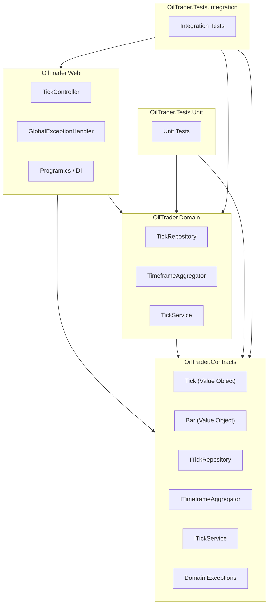

# TickController Implementation Plan

## Execution Order

1. **Save this file** to `docs/plans/tick_controller_plan.md` in the repository.
2. **Create GitHub issues** — one issue per ticket below, using the GitHub MCP. Do not start writing code until all issues are created and confirmed.
3. **Implement** — pick up issues in ticket order (T1 → T2 → … → T10b), opening a branch per ticket and referencing the issue number in commits.

> Implementation does **not** start in this session. The deliverable here is the set of GitHub issues.

---

## Architecture Target



## Project References

- `OilTrader.Contracts` — no external dependencies; pure domain types + interfaces
- `OilTrader.Domain` → `OilTrader.Contracts`
- `OilTrader.Web` → `OilTrader.Contracts`, `OilTrader.Domain`
- `OilTrader.Tests.Unit` → `OilTrader.Contracts`, `OilTrader.Domain`
- `OilTrader.Tests.Integration` → `OilTrader.Contracts`, `OilTrader.Domain`, `OilTrader.Web`

## Coding Conventions

- **Explicit constructors** — all services, repositories, handlers, and controllers use traditional `public ClassName(...)` constructors with private readonly fields; C# primary constructor syntax is not used for these types (records are the exception, where primary constructor syntax defines value-object properties)
- **Async naming** — every method returning `Task` or `Task<T>` carries the `Async` suffix

## DDD Concepts Applied

- `Tick` and `Bar` are **Value Objects** (immutable records, equality by value)
- `ITickRepository` encapsulates the rolling buffer — domain does not know about `ConcurrentQueue`
- Domain **exceptions** (`InvalidTickException`, `TickProcessingException`) bubble up; the global handler maps them to HTTP
- `ITickService` is a thin **Application Service** — coordinates saving to repo + feeding TFA; controller calls only this

## Global Exception Handler

Uses `IExceptionHandler` (introduced .NET 8, available on net10.0):

```csharp
// OilTrader.Web/Infrastructure/OilTraderExceptionHandler.cs
public class OilTraderExceptionHandler : IExceptionHandler
{
    public async ValueTask<bool> TryHandleAsync(
        HttpContext context, Exception exception, CancellationToken ct)
    { ... }
}
// Program.cs
builder.Services.AddExceptionHandler<OilTraderExceptionHandler>();
builder.Services.AddProblemDetails();
app.UseExceptionHandler();
```

Mapped exceptions:

- `InvalidTickException` → 400 Bad Request + ProblemDetails
- unhandled → 500 Internal Server Error + ProblemDetails (no stack trace in production)

## Serilog Configuration

Added to `OilTrader.Web` via `UseSerilog()` in `Program.cs`:

- Console sink (human-readable in dev)
- Rolling file sink → `logs/oiltrader-YYYYMMDD.json` (JSON structured)
- Packages: `Serilog.AspNetCore`, `Serilog.Sinks.File`

## Key Files to Create / Modify

- `src/OilTrader.Contracts/OilTrader.Contracts.csproj` — new
- `src/OilTrader.Domain/OilTrader.Domain.csproj` — new
- `src/OilTrader.Web/Program.cs` — replace boilerplate
- `src/OilTrader.Web/Controllers/TickController.cs` — new
- `src/OilTrader.Web/Infrastructure/OilTraderExceptionHandler.cs` — new

---

## Tickets (GitHub Issues)

### Ticket 1 — [SETUP] Scaffold OilTrader.Contracts and OilTrader.Domain projects

**Goal:** Add two class library projects to the solution and wire up project references.

**Tasks:**

- `dotnet new classlib` for `OilTrader.Contracts` and `OilTrader.Domain`, target `net10.0`
- `dotnet new xunit` for `OilTrader.Tests.Unit` and `OilTrader.Tests.Integration`, target `net10.0`
- Add all four projects to `OilTrader.sln`
- Add `<ProjectReference>` in `OilTrader.Domain` → `OilTrader.Contracts`
- Add `<ProjectReference>` in `OilTrader.Web` → `OilTrader.Contracts` and `OilTrader.Domain`
- Add `<ProjectReference>` in `OilTrader.Tests.Unit` → `OilTrader.Contracts` and `OilTrader.Domain`
- Add `<ProjectReference>` in `OilTrader.Tests.Integration` → `OilTrader.Contracts`, `OilTrader.Domain`, and `OilTrader.Web`
- Delete placeholder `Class1.cs` files

**AC:**

- `dotnet build` succeeds with no errors or warnings
- `dotnet sln list` shows all five projects: `OilTrader.Contracts`, `OilTrader.Domain`, `OilTrader.Web`, `OilTrader.Tests.Unit`, `OilTrader.Tests.Integration`
- `OilTrader.Domain` project references `OilTrader.Contracts`
- `OilTrader.Web` project references both `OilTrader.Contracts` and `OilTrader.Domain`
- `OilTrader.Tests.Unit` does **not** reference `OilTrader.Web` or `Microsoft.AspNetCore.Mvc.Testing`
- `OilTrader.Tests.Integration` references `Microsoft.AspNetCore.Mvc.Testing`
- No `Class1.cs` placeholder files remain

---

### Ticket 2 — [DOMAIN] Define Tick and Bar value objects in OilTrader.Contracts

**Goal:** Create the core domain models as immutable C# records.

**Files:**

- `OilTrader.Contracts/Domain/Tick.cs`
- `OilTrader.Contracts/Domain/Bar.cs`
- `OilTrader.Contracts/Domain/Timeframe.cs` (enum: M1, H1)

```csharp
// Tick.cs
public sealed record Tick(
    string Symbol,
    decimal Bid,
    decimal Ask,
    DateTimeOffset Time,
    long Volume);

// Bar.cs
public sealed record Bar(
    string Symbol,
    Timeframe Timeframe,
    DateTimeOffset OpenTime,
    decimal Open, decimal High, decimal Low, decimal Close,
    long Volume);
```

**AC:**

- `Tick` and `Bar` are `sealed record` types with positional properties
- All properties are init-only (no setters)
- `Tick` equality: two instances with the same field values are equal (`==` and `.Equals`)
- `Timeframe` enum has at minimum `M1` and `H1` members
- Project compiles with no warnings

---

### Ticket 3 — [DOMAIN] Define ITickRepository, ITimeframeAggregator and ITickService interfaces in OilTrader.Contracts

**Goal:** Express domain contracts — no implementations here.

**Files:**

- `OilTrader.Contracts/Repositories/ITickRepository.cs`
- `OilTrader.Contracts/Services/ITimeframeAggregator.cs`
- `OilTrader.Contracts/Services/ITickService.cs`
- `OilTrader.Contracts/Exceptions/InvalidTickException.cs`
- `OilTrader.Contracts/Exceptions/TickProcessingException.cs`

```csharp
public interface ITickRepository
{
    Task AddAsync(Tick tick, CancellationToken ct = default);
    Task<IReadOnlyList<Tick>> GetRecentAsync(int count, CancellationToken ct = default);
}

public interface ITimeframeAggregator
{
    void Feed(Tick tick);
    event EventHandler<Bar> M1BarClosed;
    event EventHandler<Bar> H1BarClosed;
}

public interface ITickService
{
    Task ProcessAsync(Tick tick, CancellationToken ct = default);
}
```

**AC:**

- `ITickRepository`, `ITimeframeAggregator`, and `ITickService` are defined in `OilTrader.Contracts`
- `InvalidTickException` and `TickProcessingException` inherit from `Exception` and are in `OilTrader.Contracts`
- `OilTrader.Contracts.csproj` has zero `<ProjectReference>` entries (no dependencies)
- No method bodies or field declarations exist in this project — interfaces only

---

### Ticket 4 — [DOMAIN] Implement TickRepository (1 000-tick rolling buffer) in OilTrader.Domain

**Goal:** Thread-safe rolling buffer using `ConcurrentQueue`.

**File:** `OilTrader.Domain/Repositories/TickRepository.cs`

**Behaviour:**

- `AddAsync(tick, ct)` — enqueues and trims to the last 1 000 entries; returns `Task.CompletedTask` in the current in-memory implementation
- `GetRecentAsync(count, ct)` — returns up to `count` most-recent ticks as a snapshot; returns `Task.FromResult(...)` in the current in-memory implementation
- Async signatures future-proof the interface: switching to a database-backed implementation requires no changes to callers
- Registered as `Singleton` in DI

**AC:**

- `TickRepository` uses an explicit constructor with private readonly fields (no primary constructor)
- Both `AddAsync` and `GetRecentAsync` return `Task`/`Task<T>` (no synchronous `void` or bare return types on the interface)
- Adding the 1 001st tick causes the oldest tick to be dropped (buffer stays at ≤ 1 000)
- `GetRecentAsync(n)` returns ticks in chronological order (oldest first)
- `GetRecentAsync(n)` when buffer has fewer than `n` ticks returns all available ticks without error
- Concurrent `AddAsync` calls from multiple threads do not throw or corrupt state
- Registered as `Singleton` in DI (`dotnet build` succeeds with registration in place)

---

### Ticket 5 — [DOMAIN] Implement TimeframeAggregator skeleton in OilTrader.Domain

**Goal:** Feed ticks, detect bar boundaries, raise events. Full pattern/indicator logic comes in a later ticket.

**File:** `OilTrader.Domain/Services/TimeframeAggregator.cs`

**Behaviour:**

- Maintains one open M1 bar and one open H1 bar in memory
- A bar closes when the first tick whose `time` truncated to the minute/hour differs from the current bar's open minute/hour
- Late ticks (earlier than the current bar open) are silently discarded
- Raises `M1BarClosed` and `H1BarClosed` events synchronously on the calling thread
- Registered as `Singleton` in DI

**AC:**

- `TimeframeAggregator` uses an explicit constructor with private readonly fields (no primary constructor)
- `M1BarClosed` event fires exactly once when the first tick of a new minute arrives
- `H1BarClosed` event fires exactly once when the first tick of a new hour arrives
- The closed `Bar` payload carries correct Open/High/Low/Close/Volume values for the completed bar
- A tick whose `Time` is earlier than the current open bar's `OpenTime` is silently discarded (no event, no exception)
- Registered as `Singleton` in DI

---

### Ticket 6 — [DOMAIN] Implement TickService application service in OilTrader.Domain

**Goal:** Single orchestration point called by the controller.

**File:** `OilTrader.Domain/Services/TickService.cs`

**Behaviour:**

- Validates the incoming `Tick` (non-null symbol, positive bid/ask, non-default time) — throws `InvalidTickException` on failure
- Calls `ITickRepository.AddAsync(tick, ct)`
- Calls `ITimeframeAggregator.Feed(tick)`
- Logs "Tick received" at Debug level

**AC:**

- `TickService` uses an explicit constructor with private readonly fields (no primary constructor)
- `ProcessAsync` with a null or empty `Symbol` throws `InvalidTickException`
- `ProcessAsync` with `Bid ≤ 0` or `Ask ≤ 0` throws `InvalidTickException`
- `ProcessAsync` with a default `DateTimeOffset` (year 0001) throws `InvalidTickException`
- On a valid tick, `ITickRepository.AddAsync` is called before `ITimeframeAggregator.Feed`
- A Debug-level log entry "Tick received" is emitted for every valid tick
- `InvalidTickException` propagates to the caller (not swallowed)

---

### Ticket 7 — [INFRA] Implement global exception handler using IExceptionHandler

**Goal:** Centralised HTTP error mapping — no try/catch in controllers.

**File:** `OilTrader.Web/Infrastructure/OilTraderExceptionHandler.cs`

**Mapping:**

- `InvalidTickException` → 400 + `ProblemDetails`
- Everything else → 500 + `ProblemDetails` (message hidden in production via `IHostEnvironment`)

**Registration in `Program.cs`:**

```csharp
builder.Services.AddExceptionHandler<OilTraderExceptionHandler>();
builder.Services.AddProblemDetails();
app.UseExceptionHandler();
```

**AC:**

- `OilTraderExceptionHandler` uses an explicit constructor with private readonly fields (no primary constructor)
- A request that causes `InvalidTickException` returns HTTP 400 with `Content-Type: application/problem+json`
- An unhandled exception returns HTTP 500 with `Content-Type: application/problem+json`
- In production environment, the 500 response body does not include the exception message or stack trace
- In development environment, the 500 response body includes the exception message for debuggability
- No controller action contains a `try/catch` block

---

### Ticket 8 — [INFRA] Configure Serilog and clean up Program.cs

**Goal:** Replace boilerplate startup; add structured logging; bind to `127.0.0.1:5000`.

**NuGet packages to add to `OilTrader.Web`:**

- `Serilog.AspNetCore`
- `Serilog.Sinks.File`

**Changes:**

- `Program.cs` — `UseSerilog()`, register controllers, remove weather forecast code, add `appsettings.json` with `Server.Urls` and `Risk`/`Strategy`/`ML` sections
- Set `urls: http://127.0.0.1:5000` in config (not in code)

**AC:**

- `dotnet run` starts the app and binds to `http://127.0.0.1:5000` (from config, not hardcoded)
- Console output contains structured log lines from Serilog on startup
- A `logs/oiltrader-YYYYMMDD.json` file is created and written to during the process lifetime
- The `/weatherforecast` endpoint no longer exists (returns 404)
- `appsettings.json` includes the `Server`, `Risk`, `Strategy`, `ML`, and `ExternalApis` sections from the MVP spec
- API keys in `ExternalApis` are empty strings in `appsettings.json` and documented to be set via user-secrets

---

### Ticket 9 — [API] Implement TickController (POST /tick)

**Goal:** Thin controller that delegates entirely to `ITickService`.

**File:** `OilTrader.Web/Controllers/TickController.cs`

```csharp
[ApiController]
[Route("tick")]
public class TickController : ControllerBase
{
    private readonly ITickService _tickService;
    private readonly ILogger<TickController> _logger;

    public TickController(ITickService tickService, ILogger<TickController> logger)
    {
        _tickService = tickService;
        _logger = logger;
    }

    [HttpPost]
    public async Task<IActionResult> PostTickAsync(
        [FromBody] TickRequest request, CancellationToken ct)
    {
        var tick = request.ToDomain();
        await _tickService.ProcessAsync(tick, ct);
        return Accepted();
    }
}
```

**TickRequest** DTO lives in `OilTrader.Web/Models/TickRequest.cs` with a `ToDomain()` method.

**Behaviour:**

- Returns `202 Accepted` on success
- Validation errors (model binding / `InvalidTickException`) handled by global exception handler → `400`
- Logs nothing directly — logging happens in `TickService`

**AC:**

- `TickController` uses an explicit constructor with private readonly fields (no primary constructor)
- `POST /tick` with a valid JSON body returns `202 Accepted`
- `POST /tick` with a missing or empty `symbol` field returns `400`
- `POST /tick` with `bid ≤ 0` or `ask ≤ 0` returns `400`
- `POST /tick` with a malformed JSON body returns `400`
- The controller action contains no `try/catch` and no logging calls — all delegated to service and exception handler
- `TickRequest.ToDomain()` correctly maps all fields to the `Tick` value object

---

### Ticket 10a — [TEST] Unit tests for domain services (OilTrader.Tests.Unit)

**Goal:** Fast, I/O-free tests for every domain class. No `WebApplicationFactory`, no HTTP, no disk access.

**Project:** `OilTrader.Tests.Unit` — references `OilTrader.Contracts` and `OilTrader.Domain`.

**Frameworks:** xUnit, NSubstitute (or Moq).

**Files and scenarios:**

- `TickRepositoryTests.cs`
  - 1 001st tick drops the oldest; buffer stays at exactly 1 000
  - `GetRecentAsync(n)` returns ticks in chronological order
  - `GetRecentAsync(n)` when buffer has fewer than `n` entries returns all without error
  - Concurrent `AddAsync` calls from multiple threads do not corrupt state
- `TimeframeAggregatorTests.cs`
  - `M1BarClosed` fires exactly once on the first tick of a new minute
  - `H1BarClosed` fires exactly once on the first tick of a new hour
  - Closed `Bar` payload carries correct Open/High/Low/Close/Volume values
  - Late tick (timestamp earlier than current bar open) is silently discarded — no event raised
- `TickServiceTests.cs`
  - Null or empty `Symbol` throws `InvalidTickException`
  - `Bid <= 0` throws `InvalidTickException`
  - `Ask <= 0` throws `InvalidTickException`
  - Default `DateTimeOffset` (year 0001) throws `InvalidTickException`
  - Valid tick: `AddAsync` is called on the repository before `Feed` on the aggregator
  - Valid tick: a Debug log entry is emitted

**AC:**

- `dotnet test` on `OilTrader.Tests.Unit` passes with zero failures
- Each validation rule in `TickService` has its own dedicated failing test case
- No test in this project references `Microsoft.AspNetCore.Mvc.Testing` or makes any I/O call
- Code coverage for `OilTrader.Domain` service and repository classes is >= 80%
- NSubstitute (or Moq) is used to substitute `ITickRepository` and `ITimeframeAggregator` in `TickService` tests

---

### Ticket 10b — [TEST] Integration tests for TickController slice (OilTrader.Tests.Integration)

**Goal:** Verify the full HTTP-to-domain pipeline using a real `WebApplicationFactory`. Domain services run with their real implementations; no mocking below the HTTP boundary.

**Project:** `OilTrader.Tests.Integration` — references `OilTrader.Web`, `OilTrader.Contracts`, and `OilTrader.Domain`.

**Frameworks:** xUnit, `Microsoft.AspNetCore.Mvc.Testing`.

**Approach:**

- A single `OilTraderWebApplicationFactory : WebApplicationFactory<Program>` is shared across all tests via an xUnit `[Collection]` fixture to avoid repeated startup cost.
- Domain services (`TickRepository`, `TimeframeAggregator`, `TickService`) are **not** replaced — the integration test exercises the real pipeline end-to-end.
- Side effects are verified by resolving `ITickRepository` from `factory.Services` and calling `GetRecentAsync` — no reflection or log inspection.

**Files and scenarios:**

- `TickControllerTests.cs`
  - `POST /tick` with valid JSON returns `202 Accepted`
  - `POST /tick` with valid JSON: tick is retrievable via `ITickRepository.GetRecentAsync`
  - `POST /tick` with missing `symbol` returns `400` with `Content-Type: application/problem+json`
  - `POST /tick` with `bid = 0` returns `400` with `Content-Type: application/problem+json`
  - `POST /tick` with malformed JSON returns `400`
- `GlobalExceptionHandlerTests.cs`
  - A substituted `ITickService` that throws an unhandled exception causes `500` with `Content-Type: application/problem+json`
  - In test (non-production) environment, `500` response body contains the exception message

**AC:**

- `dotnet test` on `OilTrader.Tests.Integration` passes with zero failures
- A single `WebApplicationFactory` instance is shared per xUnit collection (not recreated per test)
- No domain service is substituted in the happy-path tests — real implementations run
- Only `GlobalExceptionHandlerTests` substitutes `ITickService` (to inject a controlled fault)
- Side effects are asserted via `ITickRepository.GetRecentAsync`, not via log output or reflection
- No test makes real outbound network calls
